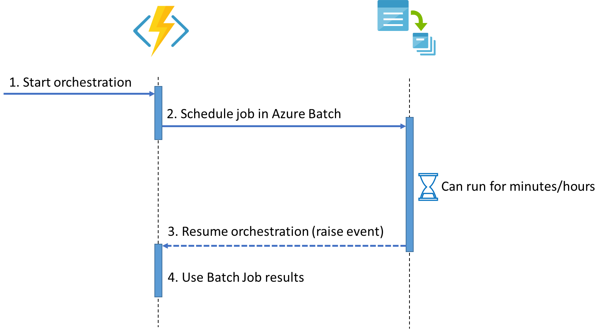

# Azure Durable Functions orchestrating Azure Batch Jobs

Sample demonstrating how to manage [Azure Batch](https://docs.microsoft.com/azure/batch/) jobs using [Azure Durable Functions](https://docs.microsoft.com/azure/azure-functions/durable/durable-functions-overview?tabs=csharp). The sample function has a simple orchestration interacting with Azure Batch, resuming work whenever the job is completed.

Use Cases:

- Basic high level Azure Batch operations using Azure Function bindings
- Create simple workflows where parts of the computation is executed in Azure Batch

## Sample workflow



```c#
[FunctionName(nameof(MultipleJobOrchestrator))]
public static async Task<string[]> MultipleJobOrchestrator(
    [OrchestrationTrigger] IDurableOrchestrationContext context)
{
    // 1. Create 3 jobs in Azure Batch
    await Task.WhenAll(
        context.CallActivityAsync(nameof(SayHelloInAzureBatch), "Tokio"),
        context.CallActivityAsync(nameof(SayHelloInAzureBatch), "Seattle"),
        context.CallActivityAsync(nameof(SayHelloInAzureBatch), "London")
        );

    // 2. Wait for all of them to be completed
    // The final task of the job will raise an event to the DurableFunction, indicating that the job is completed
    await Task.WhenAll(
        context.WaitForBatchJobAsync("Tokio"),
        context.WaitForBatchJobAsync("Seattle"),
        context.WaitForBatchJobAsync("London")
        );


    // 3. Gets the stdout from each job
    var responses = new[]
    {
        await context.CallActivityAsync<string>(nameof(GetJobStdoutAsync), "Tokio"),
        await context.CallActivityAsync<string>(nameof(GetJobStdoutAsync), "Seattle"),
        await context.CallActivityAsync<string>(nameof(GetJobStdoutAsync), "London"),
    };

    // 4. Do something with results
    await context.CallActivityAsync(nameof(Activities.WriteResultsToDatabase), responses);

    return responses;
}

[FunctionName(nameof(GetJobStdoutAsync))]
public static Task<string> GetJobStdoutAsync(
    [ActivityTrigger] IDurableActivityContext context,
    [AzureBatch(
        AccountKey = "%BATCH_ACCOUNTKEY%", 
        AccountName = "%BATCH_ACCOUNT_NAME%", 
        AccountUrl = "%BATCH_ACCOUNT_URL%")] IAzureBatchJobService azureBatchJobService)
{
    var jobId = context.GetInput<string>();
    return azureBatchJobService.GetStdOutStringAsync(context.GetJobId(jobId), "1");
}

[FunctionName(nameof(SayHelloInAzureBatch))]
public static void SayHelloInAzureBatch(
    [ActivityTrigger] IDurableActivityContext createJobContext,
    [AzureBatch(
        AccountKey ="%BATCH_ACCOUNTKEY%",
        AccountName = "%BATCH_ACCOUNT_NAME%",
        AccountUrl = "%BATCH_ACCOUNT_URL%",
        PoolId = "DedicatedLowPriorityPool1",
        PoolNodeCount = 0,
        PoolLowPriorityNodeCount = 1,
        PoolVMSize = "STANDARD_A1_v2")] out AzureBatchJob batchJob)
{
    var inputParameter = createJobContext.GetInput<string>();
    batchJob = createJobContext.CreateAzureBatchJob();
    batchJob.JobId = inputParameter;
    batchJob.ImageReference = new Microsoft.Azure.Batch.ImageReference(
        publisher: "MicrosoftWindowsServer",
        offer: "WindowsServer",
        sku: "2016-datacenter-smalldisk",
        version: "latest");
    batchJob.NodeAgentSkuId = "batch.node.windows amd64";

    batchJob.Tasks.Add(new AzureBatchTask
    {
        CommandLine = $"cmd /c echo Saying hello to {inputParameter}.",
        TaskId = "1"
    });
}
```

## Running the sample

1. Create an Azure Batch account.
1. (Local development) Setup a tunnel to your local machine (i.e. using [ngrok](https://ngrok.com/) => `ngrok http 7071`). This is required so that the Azure Batch job is able to notify the durable function that the job is completed.
1. At the root of the AzureBatchDurableFunctionSample project create a local.settings.json file with the following content:

```json
{
  "IsEncrypted": false,
  "Values": {
    "AzureWebJobsStorage": "UseDevelopmentStorage=true",
    "FUNCTIONS_WORKER_RUNTIME": "dotnet",
    "BATCH_ACCOUNTKEY": "<your-azure-batch-key>",
    "BATCH_ACCOUNT_NAME": "<your-azure-batch-account-name>",
    "BATCH_ACCOUNT_URL": "<your-azure-batch-url>",
    "CUSTOM_FUNCTION_HOST": "<for-local-only--get-value-from-ngrok>"
  }
}
```

PS.: Don't forget to delete your Azure Batch account!

## Todo

The code included in this repository is for demo purposes, before using this on serious scenarios the following would have to be addressed:

- Secure access to Azure Batch (instead of having the key as environment variable)
- Improve the "job done" notification with retries and/or handling durable function not being available for a short time period (queue/event grid based)
- Expose additional Azure Batch operations (packages, files, etc.)
